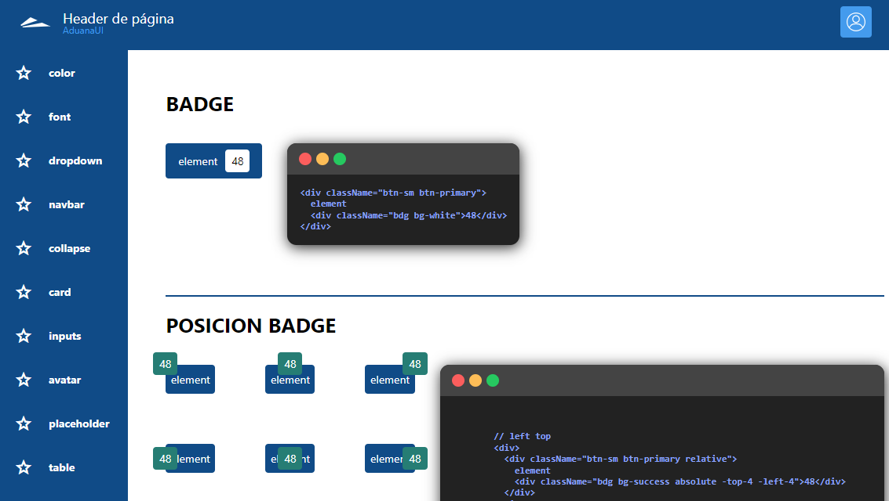

# [Live URL](https://template-aduana-paraguay.vercel.app/)

Desarrollé un framework de interfaz para el Tribunal de Aduana de Paraguay, tomando como base Bootstrap y adaptándolo a una arquitectura moderna con Tailwind CSS y Sass.

## Objetivo

Crear una base visual consistente, accesible y mantenible para productos internos, con componentes reutilizables y una estructura de estilos fácil de escalar.

## Aporte principal

- Adaptación de patrones de Bootstrap a utilidades de Tailwind CSS.
- Estructura Sass modular con variables, mixins y parciales para facilitar mantenimiento.
- Implementación responsive para distintos tamaños de pantalla.
- Entrega de documentación y ejemplos HTML para acelerar adopción del equipo.

## Resultado

El framework permitió estandarizar estilos y componentes, reduciendo fricción en desarrollo y mejorando la velocidad de implementación de nuevas pantallas.

## Captura principal (asset local)

