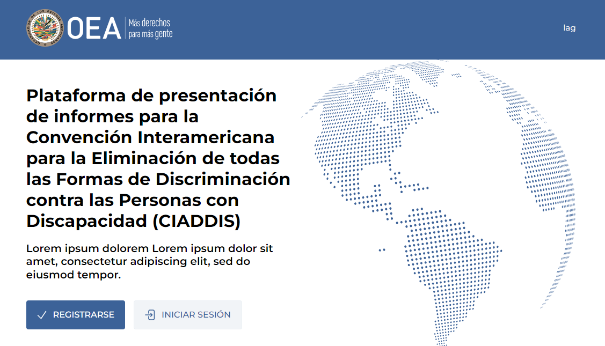
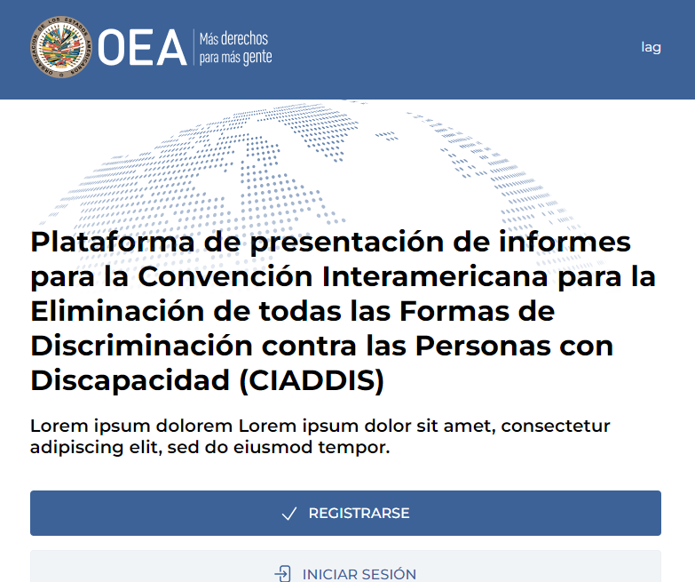
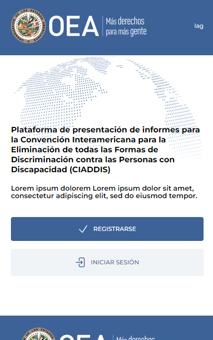

plataforma web para la Convención Interamericana para la Eliminación de todas las Formas de Discriminación contra las Personas con Discapacidad (CIADDIS), facilitando a los Estados Partes la creación, envío y gestión de informes sobre el cumplimiento de la Convención.

### **Requisitos Clave:**
- Interfaz atractiva y accesible, adaptable a diversos dispositivos.
- Arquitectura robusta y escalable utilizando CSS y SASS.
- Funcionalidades para registro, autenticación, gestión de informes y perfiles de usuario.
- Cumplimiento de las especificaciones de diseño de las Naciones Unidas, entregando archivos en formato HTML.

### **Logros:**
- Diseñé e implementé la interfaz visual, asegurando una experiencia de usuario intuitiva y consistente.
- Realicé pruebas de usabilidad y optimización, logrando una reducción del 30% en errores de navegación.
- La plataforma mejoró significativamente la eficiencia en el proceso de informes, recibiendo comentarios positivos de los usuarios y facilitando la presentación de informes a las Naciones Unidas.

Este proyecto no solo me permitió aplicar mis habilidades como desarrollador web, sino que también contribuyó a un cambio social significativo al abordar la discriminación contra personas con discapacidad.

## Galería local por dispositivo

### Escritorio

### Tableta

### Móvil

