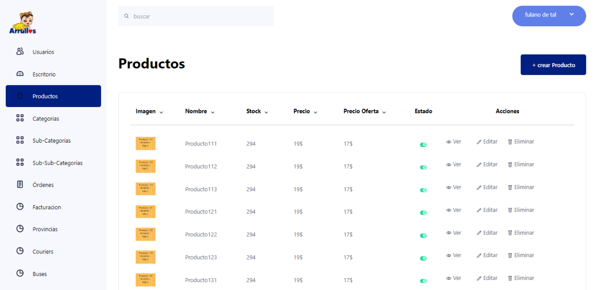
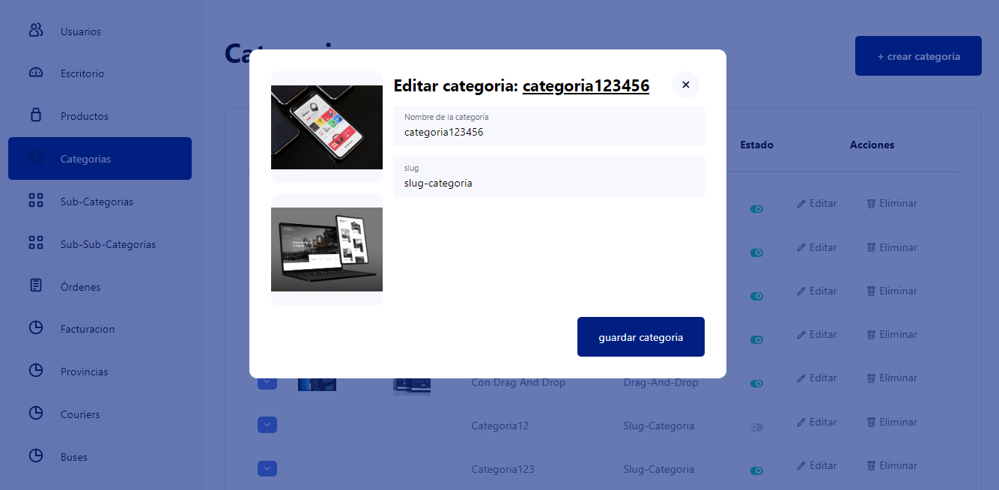
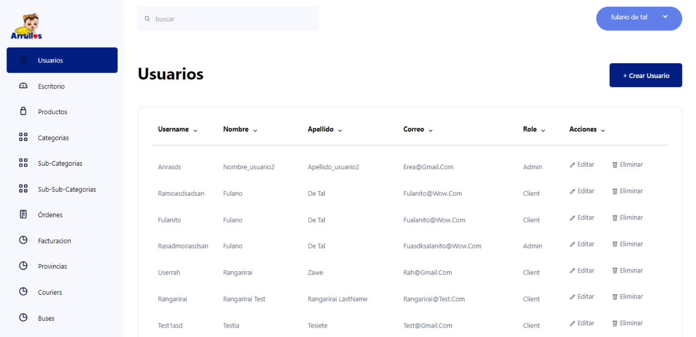
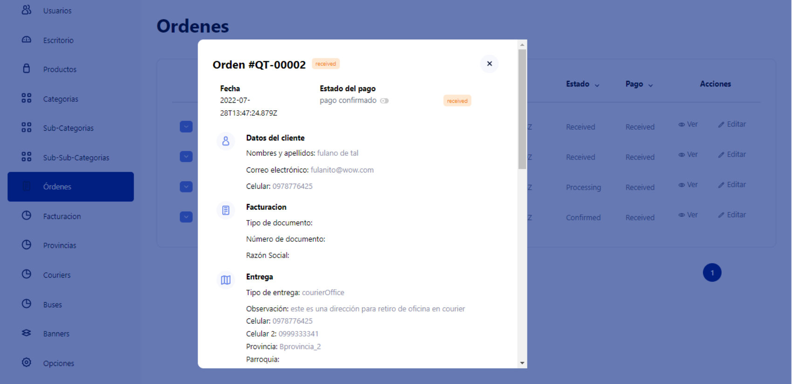
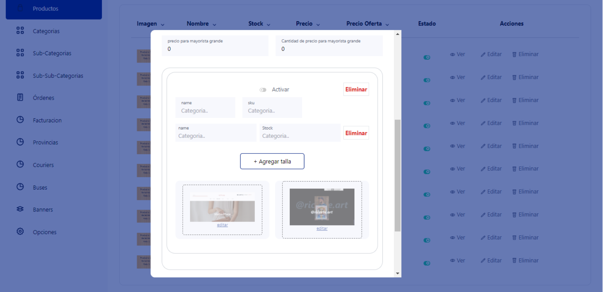
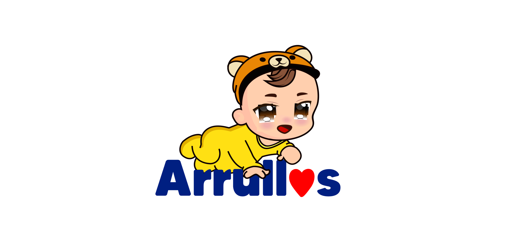

# Arrullos - Dashboard administrativo

Arrullos fue mi primer proyecto profesional. Me integré al equipo para desarrollar el frontend de una web administrativa de e-commerce en Next.js, partiendo de un diseño ya definido previamente.

## Rol y contexto

- Mi foco fue 100% frontend.
- El diseño visual y UI ya estaban definidos antes de mi integración.
- Recibí una API GraphQL para consumir la información del sistema.

## Implementación técnica

- Desarrollo de interfaz administrativa en Next.js.
- Integración con API GraphQL para listados, detalle y acciones de gestión.
- Subida y gestión de imágenes con servicios de AWS.
- Uso de Redux para estado global.
- Uso de React Query para optimizar consumo de datos, caché y estados de carga.

## Alcance funcional

- Gestión de productos, categorías y subcategorías.
- Administración de variantes y stock.
- Seguimiento de órdenes con detalle de cliente, facturación y entrega.
- Módulos de usuarios, couriers, provincias y buses.

## Resultado

Este proyecto marcó el inicio de mi experiencia profesional en entornos reales, trabajando con flujos de frontend productivos, integración de APIs y optimización de rendimiento en una aplicación administrativa.

## Galería local por dispositivo

### Escritorio

### Tableta

### Móvil

## Otras vistas del sistema

