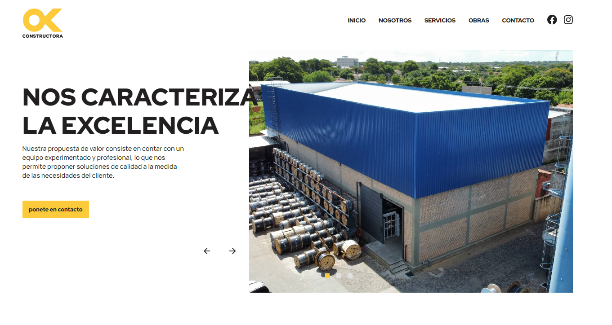
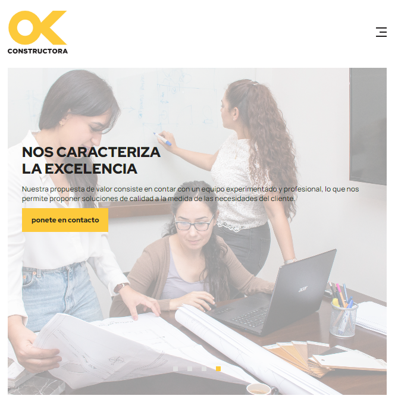
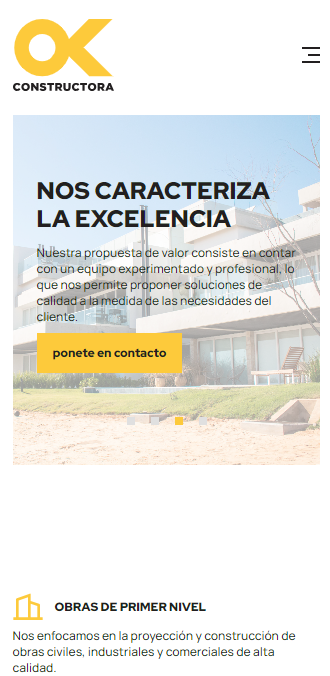

OKConstructora es una empresa del sector construcción enfocada en obras civiles, industriales y comerciales.

## Objetivo del proyecto

Reemplazar una implementación con limitaciones de rendimiento y adaptabilidad móvil por una solución frontend más optimizada y mantenible.

## Actividades desempeñadas

- Desarrollo de plantilla personalizada para WordPress.
- Implementación de interfaz con Tailwind CSS y Sass.
- Desarrollo de componentes interactivos y carruseles con JavaScript.
- Soporte a flujos de integración y despliegue.

## Stack tecnológico

- WordPress
- Tailwind CSS, Sass
- JavaScript
- cPanel

## Galería local por dispositivo

### Escritorio

### Tableta

### Móvil

