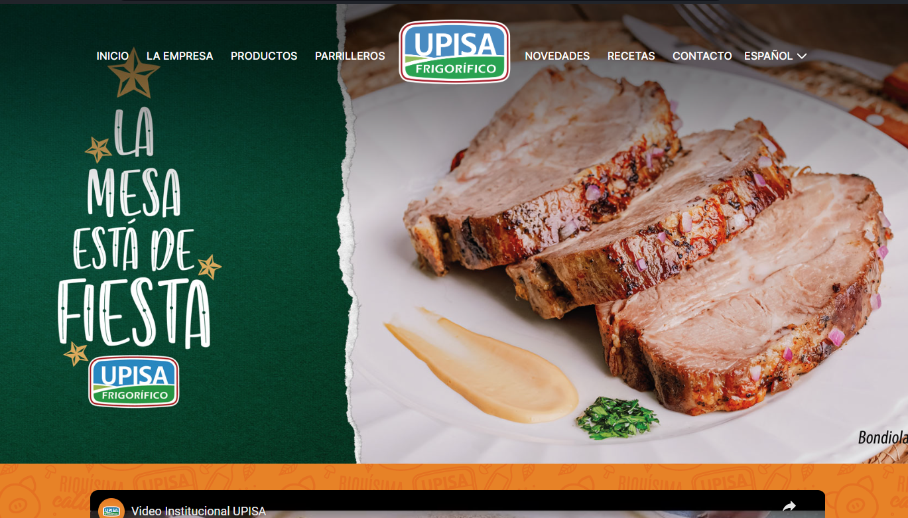
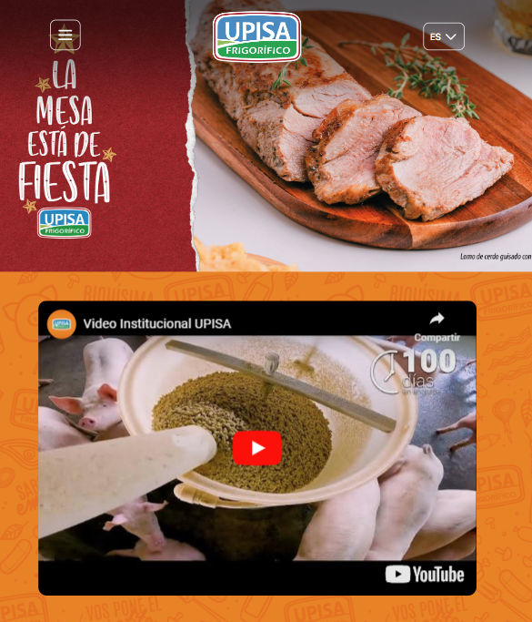
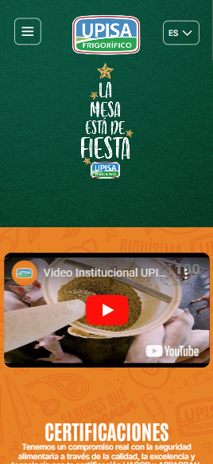

**UPISA**, una marca líder en distribución de embutidos y cárnicos, mejorando la experiencia del usuario y ampliando su alcance global.

Proyecto de rediseño e internacionalización del sitio oficial de UPISA para mejorar experiencia de usuario y ampliar alcance comercial internacional.

### Logros Clave

1. **Internacionalicé el Contenido**: Traduje el sitio a ruso, chino, inglés y español, lo que permitió un aumento del 40% en la base de clientes internacionales en seis meses.

2. **Mejoré la Usabilidad**: Implementé un diseño intuitivo, reduciendo la tasa de rebote en un 25% y aumentando el tiempo de permanencia en el sitio en un 30%.

3. **Desarrollé un Administrador de Contenidos**: Creé un sistema en **Python y Django** que permitió al cliente actualizar textos, imágenes y videos de manera autónoma, reduciendo el tiempo de gestión de contenido en un 50%.

4. **Introduje Módulos Interactivos**: Desarrollé un catálogo de productos filtrado, un módulo de recetas y una calculadora de requisitos, mejorando la interacción del usuario y aumentando las consultas sobre productos en un 20%.

5. **Optimicé el SEO Multilingüe**: Implementé estrategias de SEO en cada idioma, lo que resultó en un incremento del 35% en el tráfico orgánico.

### Stack Tecnológico

- **Django**: Para un desarrollo escalable y gestión de contenido.
- **React.js**: Para componentes interactivos que mejoraron la respuesta del sitio.
- **Tailwind CSS y Sass**: Para un diseño moderno y responsivo.
- **JavaScript Vanilla**: Para interacciones dinámicas.
- **Cpanel Hosting**: Para una gestión sencilla y efectiva del sitio.

### Conclusión

El rediseño e internacionalización del sitio web de UPISA no solo mejoraron la experiencia del usuario, sino que también posicionaron a la empresa para un crecimiento del 40% en el mercado internacional. Estoy listo para seguir generando un impacto significativo en proyectos futuros.

## Galería local por dispositivo

### Escritorio

### Tableta

### Móvil

